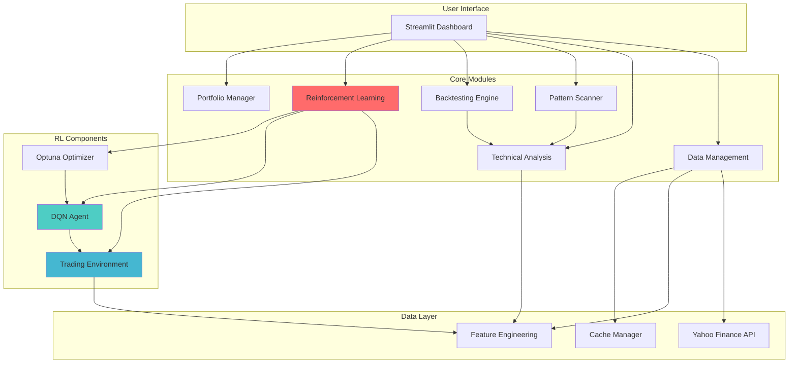
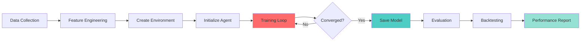
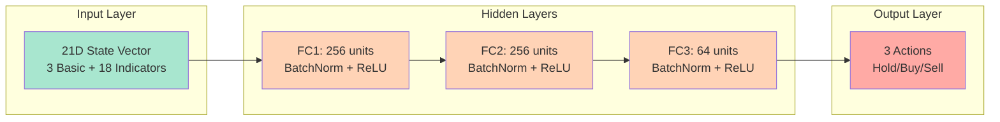
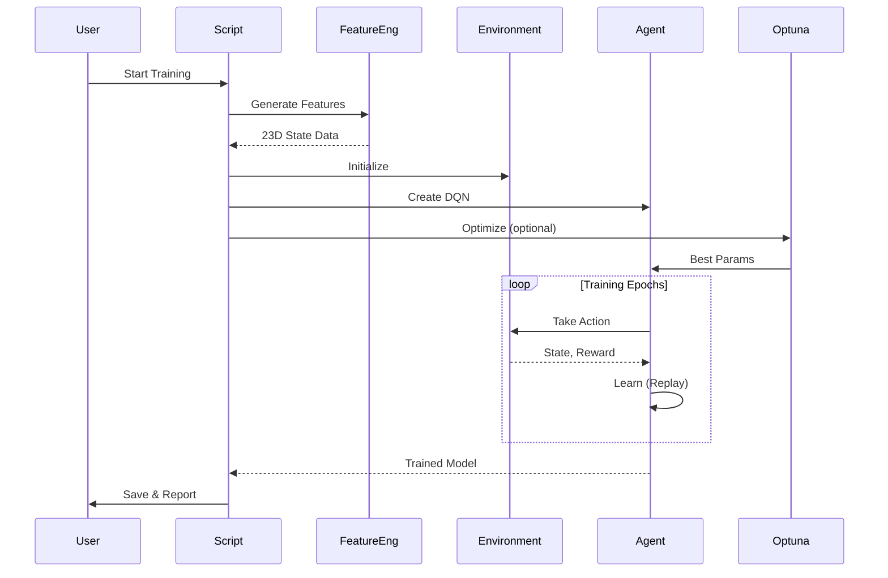
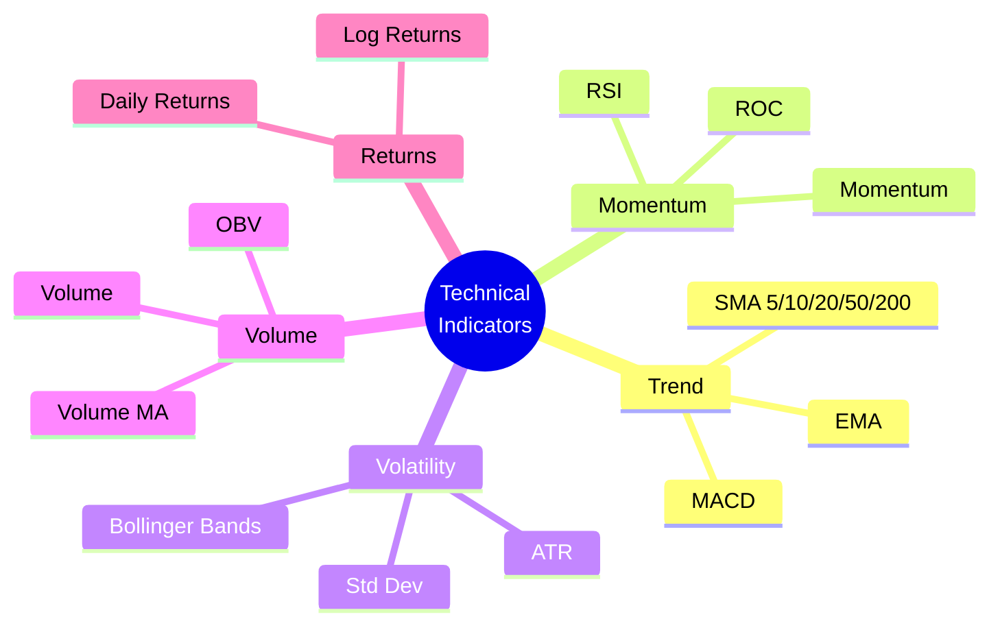
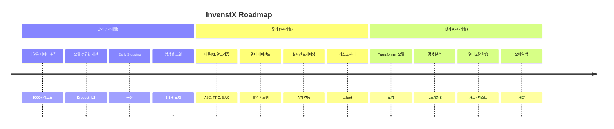
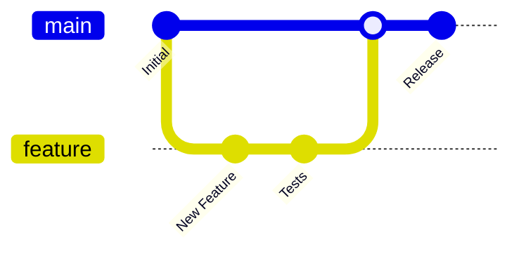

# InvenstX - AI 기반 주식 트레이딩 시스템

InvenstX는 기술적 분석, 패턴 인식, 백테스팅, 그리고 **강화학습 기반 트레이딩**을 지원하는 종합 AI 트레이딩 시스템입니다.


## 🌟 주요 기능

### 1. 📊 주식 데이터 분석
- Yahoo Finance API를 통한 실시간 데이터 수집
- 20+ 기술적 지표 자동 계산 (RSI, MACD, 볼린저 밴드, ATR 등)
- 인터랙티브 차트 시각화 (Plotly)

### 2. 🔍 패턴 스캐너
- 차트 패턴 자동 감지
  - 헤드앤숄더, 더블탑/바텀
  - 볼린저 밴드 패턴
  - 캔들스틱 패턴
- 패턴 기반 매매 신호 생성

### 3. 📈 백테스팅 엔진
- 다양한 트레이딩 전략 백테스팅
  - 이동평균 크로스오버
  - RSI 기반 전략
  - 볼린저 밴드 전략
- 성과 지표 자동 계산 (샤프 비율, MDD, 승률 등)

### 4. 🤖 강화학습 트레이딩 (핵심 기능)
- **DQN (Deep Q-Network)** 기반 트레이딩 에이전트
- **23차원 상태 공간**: 기본 정보 + 18개 기술적 지표
- **3가지 투자 스타일**:
  - 장기 투자 (Long-term)
  - 스윙 트레이딩 (Swing Trade)
  - 기본 전략 (Default)
- **하이퍼파라미터 최적화** (Optuna)
- Apple Silicon (MPS) GPU 가속 지원

### 5. 💼 포트폴리오 관리
- 다종목 포트폴리오 구성 및 관리
- 실시간 성과 모니터링
- 리스크 분석

### 6. 🎯 멀티 에이전트 시스템
- 여러 트레이딩 전략을 조합한 앙상블 시스템
- 에이전트 간 협업 및 경쟁 메커니즘

## 🏆 성과

### 강화학습 모델 성능 (AAPL 백테스트)
| 모델 | 수익률 | 샤프 비율 | 거래 횟수 |
|------|--------|-----------|----------|
| Buy & Hold | 19.13% | - | 1 |
| 3D 기본 모델 | 0.00% | 0.0000 | 0 |
| **23D 강화 모델** | **18.25%** | **0.4784** | 468 |
| 23D 최적화 모델 | 6.61% | 0.2636 | 343 |

**최고 성과**: 23D 강화 모델 - Buy & Hold 대비 -0.88%p (거의 동등)

## 🏗️ 시스템 아키텍처



## 🔄 강화학습 워크플로우



## 📊 DQN 네트워크 구조



## 📁 프로젝트 구조

```
invenstx/
├── main.py                      # Streamlit 메인 대시보드
├── app.py                       # 간단한 UI (기본 분석)
├── config.py                    # 전역 설정
│
├── data/                        # 데이터 관리
│   ├── fetch_data.py           # 주식 데이터 다운로드
│   ├── data_loader.py          # 데이터 전처리
│   └── feature_engineering.py  # 기술적 지표 생성 (18개)
│
├── indicators/                  # 기술적 지표
│   ├── rsi.py, macd.py         # 기본 지표
│   ├── technical_indicators.py # 종합 지표 계산
│   └── patterns/               # 패턴 감지
│       ├── pattern_analyzer.py
│       ├── bollinger_bands.py
│       ├── double_bottom.py
│       └── candlestick_patterns.py
│
├── reinforcement_learning/      # 강화학습 모듈
│   ├── environment.py          # 기본 환경 (3D)
│   ├── environment_enhanced.py # 강화 환경 (23D)
│   ├── model.py                # DQN 모델 구현
│   ├── train.py                # 학습 스크립트
│   └── evaluate.py             # 평가 스크립트
│
├── charts/                      # 시각화
│   ├── stock_charts.py
│   ├── technical_charts.py
│   └── pattern_charts.py
│
├── models/                      # 학습된 모델 저장
│   └── *.pth                   # PyTorch 모델 파일
│
├── results/                     # 실험 결과
│   ├── *.csv                   # 학습 히스토리
│   └── *.json                  # 최적화 설정
│
├── tests/                       # 테스트
│   ├── unit/
│   └── integration/
│
└── utils/                       # 유틸리티
    └── cache_manager.py        # 캐싱 관리
```

## 🚀 설치 및 실행

### 1. 요구사항
- Python 3.8+
- macOS / Linux / Windows

### 2. 설치

```bash
# 저장소 클론
git clone https://github.com/Photometry4040/invenstX.git
cd invenstX

# 가상 환경 생성
python -m venv .venv
source .venv/bin/activate  # Windows: .venv\Scripts\activate

# 패키지 설치
pip install -r requirements.txt
```

### 3. 실행

```bash
# 메인 대시보드 실행
streamlit run main.py

# 또는 간단한 UI
streamlit run app.py
```

## 🧪 강화학습 모델 학습

### 학습 파이프라인



### 1. 데이터 준비
```bash
# 주식 데이터 다운로드 및 정제는 자동으로 수행됩니다
```

### 2. 기본 학습 (23D 강화 모델)
```bash
python train_enhanced_model.py \
  --ticker AAPL \
  --epochs 50 \
  --batch-size 32 \
  --style default
```

### 3. 하이퍼파라미터 최적화
```bash
python optimize_hyperparams.py \
  --ticker AAPL \
  --style default \
  --n-trials 30 \
  --quick
```

### 4. 최적화된 파라미터로 학습
```bash
python train_optimized.py
```

### 5. 모델 평가
```bash
python evaluate_enhanced_model.py \
  --ticker AAPL \
  --style default
```

## 📊 투자 스타일

시스템은 3가지 투자 스타일을 지원합니다:

| 스타일 | Gamma | 거래 비용 | 보유 인센티브 | 특징 |
|--------|-------|----------|--------------|------|
| **Long Term** | 0.99 | 0.002 | 0.001 | 장기 보유 선호 |
| **Swing Trade** | 0.95 | 0.001 | 0.0005 | 중기 트레이딩 |
| **Default** | 0.95 | 0.0005 | 0.0 | 균형잡힌 전략 |

## 🧰 주요 기술 스택

### Backend
- **Python 3.8**: 메인 프로그래밍 언어
- **PyTorch 2.4**: 딥러닝 프레임워크
- **Optuna**: 하이퍼파라미터 최적화
- **NumPy/Pandas**: 데이터 처리

### Frontend
- **Streamlit**: 웹 대시보드
- **Plotly**: 인터랙티브 차트

### Data
- **yfinance**: Yahoo Finance API 클라이언트
- **scikit-learn**: 데이터 전처리

### ML/RL
- **DQN**: Deep Q-Network
- **Experience Replay**: 경험 재생 메모리
- **Target Network**: 학습 안정화

## 📈 기술적 지표 (18개)



1. **RSI** (Relative Strength Index)
2. **MACD** (Moving Average Convergence Divergence)
3. **볼린저 밴드** (Bollinger Bands)
4. **이동평균** (MA 5, 10, 20, 50, 200)
5. **ATR** (Average True Range)
6. **거래량** 지표
7. **수익률** (Daily Returns)
8. **모멘텀** 지표
9. **변동성** (Volatility)
10. 기타 파생 지표

## 🧪 테스트

```bash
# 전체 테스트 실행
./run_tests.sh

# 유닛 테스트만
python -m unittest discover -s tests/unit

# 통합 테스트만
python -m unittest discover -s tests/integration
```

## 📚 문서

추가 문서는 프로젝트 내 다음 파일들을 참조하세요:

- `CLAUDE.md`: Claude Code를 위한 개발 가이드
- `FEATURE_ENGINEERING_GUIDE.md`: 기술적 지표 추가 가이드
- `IMPROVEMENT_PLAN.md`: 시스템 개선 계획
- `.claude/commands/`: 커스텀 명령어 문서

## 🔮 향후 개선 계획



### 단기 (1-2개월)
- [ ] 더 많은 주식 데이터 수집 (1000+ 레코드)
- [ ] 모델 정규화 개선 (Dropout, L2)
- [ ] Early Stopping 구현
- [ ] 앙상블 모델 구현

### 중기 (3-6개월)
- [ ] 다른 RL 알고리즘 추가 (A3C, PPO, SAC)
- [ ] 멀티 에이전트 협업 시스템
- [ ] 실시간 트레이딩 연동 (API)
- [ ] 리스크 관리 모듈 강화

### 장기 (6-12개월)
- [ ] Transformer 기반 모델 도입
- [ ] 뉴스/소셜미디어 감성 분석
- [ ] 멀티모달 학습 (차트 + 텍스트)
- [ ] 모바일 앱 개발

## ⚠️ 면책 조항

**이 프로젝트는 교육 및 연구 목적으로만 사용되어야 합니다.**

- 실제 투자에 사용하기 전에 충분한 백테스팅과 검증이 필요합니다.
- 과거 성과가 미래 수익을 보장하지 않습니다.
- 투자 결정은 본인의 책임 하에 이루어져야 합니다.
- 금융 손실에 대한 책임은 사용자에게 있습니다.

## 📄 라이선스

MIT License - 자세한 내용은 `LICENSE` 파일을 참조하세요.

## 👥 기여

기여는 언제나 환영합니다!



1. Fork the repository
2. Create your feature branch (`git checkout -b feature/AmazingFeature`)
3. Commit your changes (`git commit -m 'Add some AmazingFeature'`)
4. Push to the branch (`git push origin feature/AmazingFeature`)
5. Open a Pull Request

## 📧 문의

프로젝트 관련 문의사항이나 버그 리포트는 GitHub Issues를 통해 남겨주세요.

---

**Made with ❤️ by InvenstX Team**

*AI와 함께하는 더 스마트한 투자*
